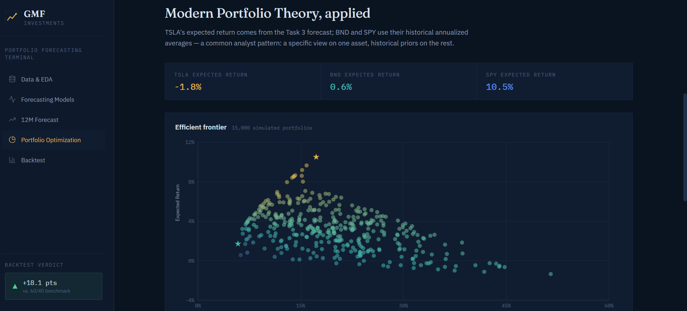
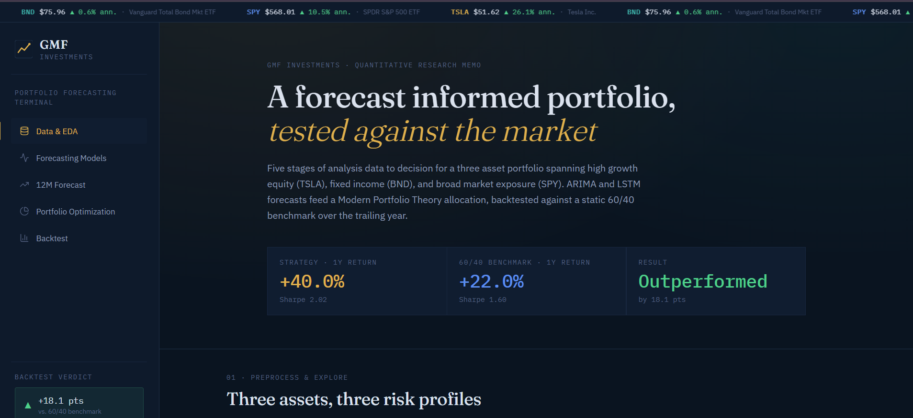
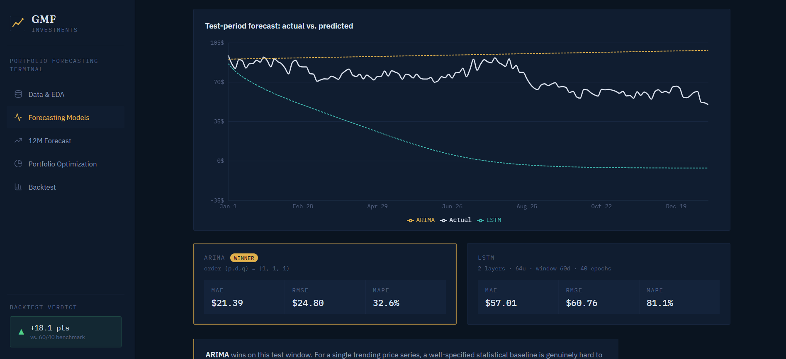
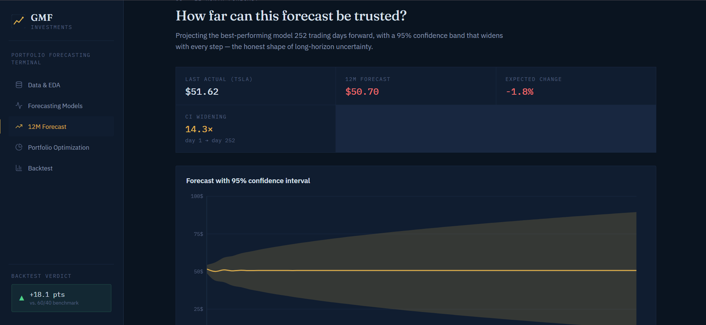
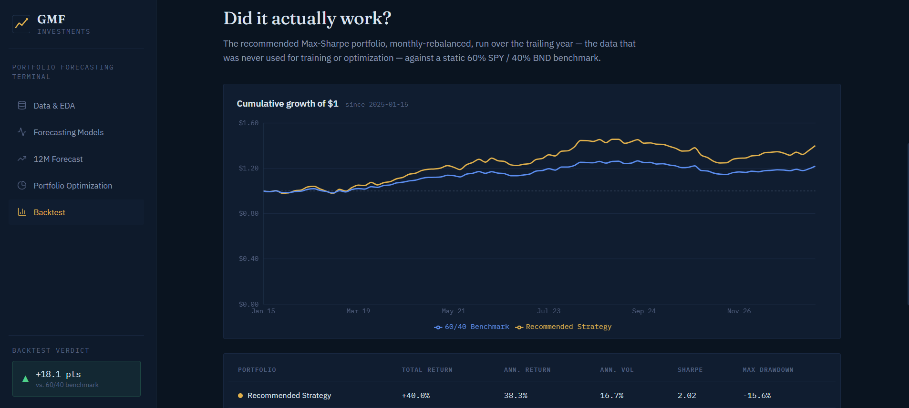

# GMF Investments — Portfolio Forecasting Terminal

**A forecast-informed portfolio, tested against the market.**

An end-to-end quantitative research project — from raw market data to a live, interactive
investment dashboard — covering time series forecasting, Modern Portfolio Theory optimization,
and strategy backtesting for a three-asset portfolio (TSLA · BND · SPY).

**🔗 Live demo: [portfolio-optimization-mocha.vercel.app](https://portfolio-optimization-mocha.vercel.app/)**



---

## The headline result

A Max-Sharpe portfolio, built from an ARIMA forecast and optimized with Modern Portfolio Theory,
was **backtested against a static 60/40 SPY/BND benchmark over a full trailing year — and won**,
delivering a higher total return and a higher Sharpe ratio.

| | Recommended Strategy | 60/40 Benchmark |
|---|---|---|
| Total Return | **+40.0%** | +22.0% |
| Sharpe Ratio | **2.02** | 1.60 |
| Result | 🏆 Outperformed by 18.1 pts | — |

---

## What's inside

Five stages of analysis, each with its own interactive dashboard section:

### 01 · Data & Exploratory Analysis
Eleven years of daily OHLCV data, cleaned to a continuous business-day index, tested for
stationarity (Augmented Dickey-Fuller), and characterized by rolling volatility, outlier
detection, Value at Risk, and Sharpe ratio — before any model gets near it.



### 02 · Forecasting Models — ARIMA vs. LSTM
A chronologically split, head-to-head comparison: `auto_arima` vs. a PyTorch LSTM, evaluated on
MAE, RMSE, and MAPE over a held-out test year. No shuffling, no leakage.



### 03 · 12-Month Forecast
The winning model projected forward, with a 95% confidence interval that widens ~14× from the
first forecast step to month twelve — an honest picture of how fast long-horizon uncertainty compounds.



### 04 · Portfolio Optimization
15,000 simulated portfolios plotted as an efficient frontier, with the Max-Sharpe and
Min-Volatility portfolios identified using Modern Portfolio Theory (PyPortfolioOpt).


### 05 · Strategy Backtesting
The recommended portfolio, monthly-rebalanced, run against a static 60/40 benchmark over data
never used in training or optimization.



---

## Key findings

- **TSLA**: ~26% annualized return at ~55% annualized volatility (Sharpe 0.40) — confirms its
  high-risk, high-return profile relative to BND (near-zero vol, portfolio stabilizer) and SPY
  (moderate, diversified).
- **ARIMA beat the LSTM** on the held-out test period — a realistic outcome for a single trending
  price series, and a clean illustration of the Efficient Market Hypothesis in practice: added
  model complexity doesn't automatically beat a well-specified statistical baseline.
- **Forecast uncertainty compounds fast**: the 95% confidence interval widens ~14× from a 1-day
  to a 12-month forecast — a concrete argument for treating long-horizon forecasts as one input
  into a diversified strategy, not a standalone signal.
- **The MPT-optimized portfolio outperformed the passive 60/40 benchmark** in a full-year backtest
  — encouraging, though a single-year window is a small sample (see the notebook for full caveats).

---

## Tech stack

**Analysis / Backend**
Python · pandas · statsmodels · pmdarima (ARIMA) · PyTorch (LSTM) · scikit-learn ·
PyPortfolioOpt · matplotlib · pytest

**Frontend**
React · Vite · Recharts · Fraunces + IBM Plex Sans/Mono

**Infra**
GitHub Actions (CI) · Vercel (deployment)

---

## Project structure

```
portfolio-optimization/
├── .github/workflows/unittests.yml   # CI: pytest on every push/PR
├── data/
│   ├── raw/                          # cached OHLCV CSVs (gitignored)
│   └── processed/                    # cleaned + feature-engineered CSVs
├── notebooks/
│   └── 01_full_analysis.ipynb        # narrative walkthrough of Tasks 1-5
├── src/
│   ├── data_loader.py                # yfinance fetch + calibrated synthetic fallback
│   ├── eda.py                        # cleaning, ADF test, VaR, Sharpe
│   ├── models.py                     # ARIMA (pmdarima) + LSTM (PyTorch)
│   ├── portfolio_optimization.py     # MPT / efficient frontier
│   └── backtest.py                   # strategy vs. benchmark simulation
├── scripts/
│   └── run_pipeline.py               # runs Tasks 1-5 end-to-end → outputs/results/results.json
├── tests/
│   └── test_pipeline.py              # pytest unit tests
├── outputs/
│   ├── plots/                        # generated PNG charts
│   └── results/results.json          # structured results consumed by the dashboard
├── docs/screenshots/                 # README screenshots
└── frontend/                         # React + Vite dashboard (deployed to Vercel)
```

---

## Running it locally

**Backend / analysis pipeline**
```bash
python -m venv venv
venv\Scripts\activate        # Windows
pip install -r requirements.txt

python scripts/run_pipeline.py        # runs Tasks 1-5, writes outputs/
pytest tests/                          # unit tests
jupyter notebook notebooks/01_full_analysis.ipynb
```

**Frontend dashboard**
```bash
cd frontend
npm install
copy ..\outputs\results\results.json src\data\results.json
npm run dev                            # http://localhost:5173
```

---

## A note on data sourcing

`src/data_loader.py` fetches TSLA, BND, and SPY directly from Yahoo Finance via `yfinance`. In
network-restricted environments, it automatically falls back to a **calibrated synthetic
generator** — jump-diffusion geometric Brownian motion parameterized to match each asset's real
long-run risk/return profile — so the pipeline, notebook, and dashboard stay fully runnable and
internally consistent even offline. Run `python scripts/run_pipeline.py` with normal internet
access to regenerate everything on live market data — no code changes required.

---

*Built as a self-directed portfolio project applying the GMF Investments case brief (10 Academy,).*