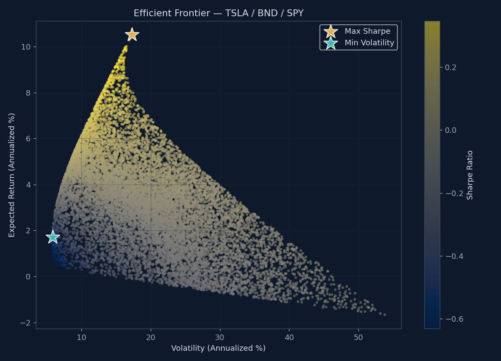

# Time Series Forecasting for Portfolio Management Optimization

**GMF Investments** — a full-stack quantitative research + client-facing dashboard project covering
data-driven portfolio management: EDA, ARIMA/LSTM forecasting, Modern Portfolio Theory optimization,
and strategy backtesting for a three-asset portfolio (TSLA / BND / SPY).

Built as a portfolio piece demonstrating end-to-end financial ML engineering — from raw market data to a
polished, investment-memo-style interactive dashboard a non-technical stakeholder could actually use.



## What this project does

| Task | Deliverable |
|---|---|
| 1. Preprocess & Explore | Data cleaning, rolling volatility, outlier detection, ADF stationarity tests, VaR & Sharpe |
| 2. Forecasting Models | Chronologically-split ARIMA (`auto_arima`) vs. LSTM (PyTorch), compared on MAE/RMSE/MAPE |
| 3. Future Forecast | 12-month TSLA forecast with widening confidence intervals + reliability discussion |
| 4. Portfolio Optimization | MPT efficient frontier, Max-Sharpe & Min-Volatility portfolios (PyPortfolioOpt) |
| 5. Backtesting | Monthly-rebalanced recommended portfolio vs. a static 60/40 SPY/BND benchmark |

## Project structure

```
portfolio-optimization/
├── .github/workflows/unittests.yml   # CI: runs pytest on every push/PR
├── .vscode/settings.json
├── data/
│   ├── raw/                          # cached OHLCV CSVs per ticker
│   └── processed/                    # cleaned + feature-engineered CSVs
├── notebooks/
│   └── 01_full_analysis.ipynb        # narrative walkthrough of Tasks 1-5 (pre-executed)
├── src/
│   ├── data_loader.py                # yfinance fetch (+ calibrated synthetic fallback)
│   ├── eda.py                        # cleaning, ADF test, VaR, Sharpe
│   ├── models.py                     # ARIMA (pmdarima) + LSTM (PyTorch)
│   ├── portfolio_optimization.py     # MPT / efficient frontier
│   └── backtest.py                   # strategy vs. benchmark simulation
├── scripts/
│   └── run_pipeline.py               # runs Tasks 1-5 end-to-end, writes outputs/results/results.json
├── tests/
│   └── test_pipeline.py              # pytest unit tests for core logic
├── outputs/
│   ├── plots/                        # PNG charts (also embedded below)
│   └── results/results.json          # structured results consumed by the React dashboard
└── frontend/                         # React + Vite investment dashboard (reads results.json)
```

## Running it

```bash
python -m venv .venv && source .venv/bin/activate
pip install -r requirements.txt

python scripts/run_pipeline.py        # runs Tasks 1-5, writes outputs/
pytest tests/                          # unit tests
jupyter notebook notebooks/01_full_analysis.ipynb   # narrative version

cd frontend
npm install
npm run dev                            # dashboard at http://localhost:5173
```

## A note on data sourcing

`src/data_loader.py` fetches TSLA, BND, and SPY directly from Yahoo Finance via `yfinance`. **In network-
restricted environments** (e.g. this repo was authored in a sandboxed dev environment with no access to
Yahoo Finance's API hosts) it automatically falls back to a **calibrated synthetic generator**: jump-diffusion
geometric Brownian motion parameterized to match each asset's real long-run risk/return profile (TSLA:
high-growth/high-vol; BND: low-vol/stable; SPY: moderate-vol/diversified). This keeps the full pipeline —
and every chart, metric, and dashboard number in this repo — runnable and internally consistent end-to-end.
**Run `python scripts/run_pipeline.py` with normal internet access to regenerate everything on real market
data** — no code changes needed, just delete `data/raw/*.csv` and re-run.

## Key findings (this run)

- **TSLA**: ~26% annualized return at ~55% annualized volatility (Sharpe 0.40) — confirms its high-risk,
  high-return profile relative to BND (near-zero vol, portfolio stabilizer) and SPY (moderate, diversified).
- **ARIMA outperformed the LSTM** on the held-out test period — a realistic outcome for a single trending
  price series and a good illustration of the Efficient Market Hypothesis in practice: added model
  complexity doesn't automatically beat a well-specified statistical baseline on daily closes.
- **Forecast uncertainty compounds fast**: the 95% confidence interval widens roughly 14x from the 1-day-out
  to the 12-month-out forecast — a concrete illustration of why long-horizon single-asset forecasts should
  inform, not dictate, portfolio decisions.
- **The Max-Sharpe MPT portfolio outperformed the static 60/40 SPY/BND benchmark** in the one-year backtest
  (higher return and Sharpe, with correspondingly higher volatility/drawdown) — an encouraging but
  small-sample result; see the notebook's Task 5 conclusion for backtest limitations.

## Tech stack

**Analysis:** Python, pandas, statsmodels, pmdarima, PyTorch, scikit-learn, PyPortfolioOpt, matplotlib
**Frontend:** React, Vite, Recharts
**Tooling:** pytest, GitHub Actions CI

---
*Built as a self-directed portfolio project applying the GMF Investments case brief (10 Academy, Week 9).*
